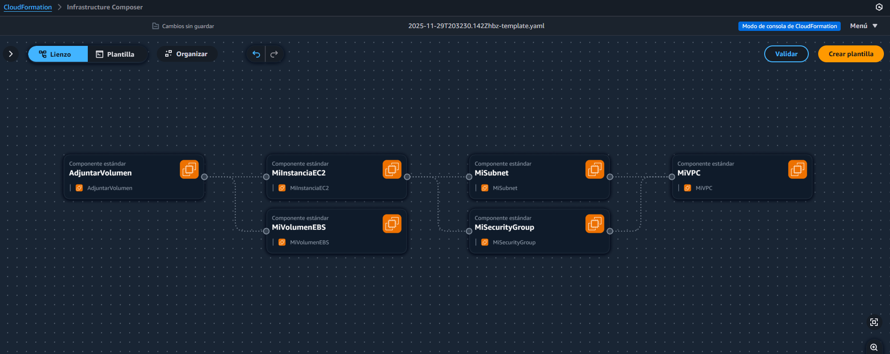
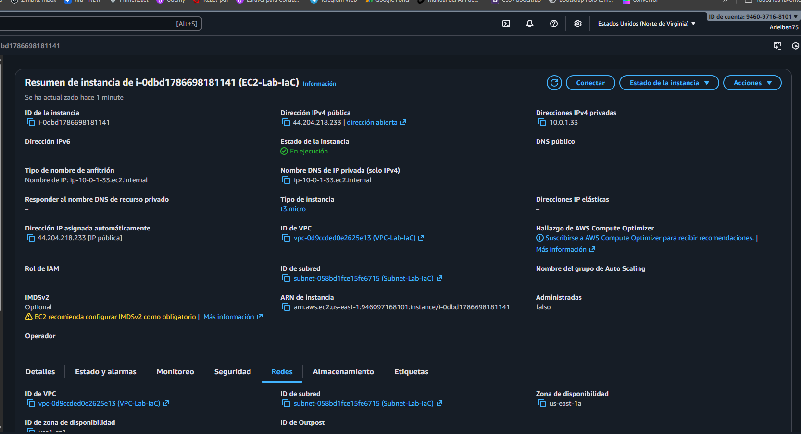
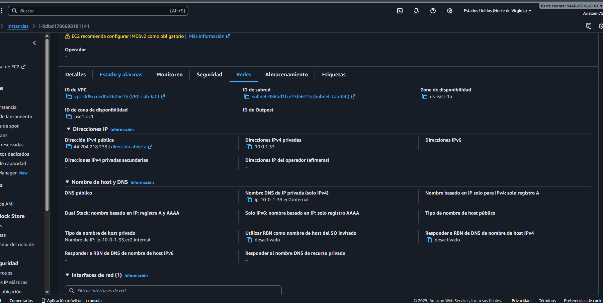
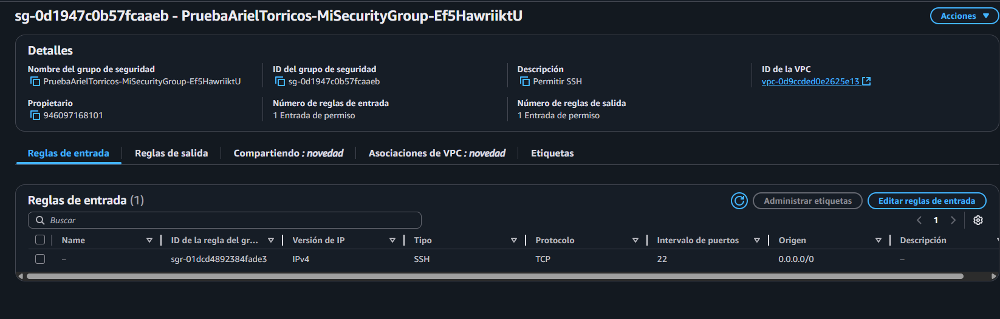
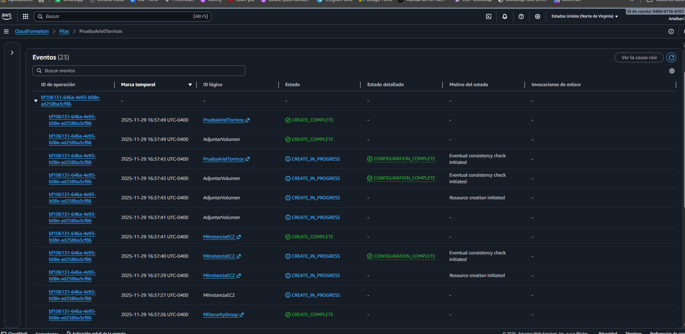
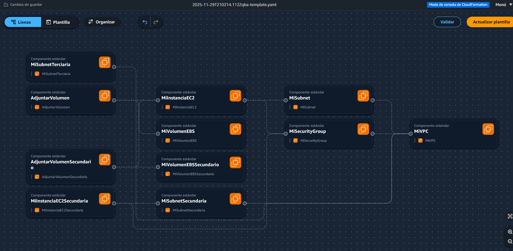

# Laboratorio IaC - AWS CloudFormation

Este proyecto contiene una plantilla de CloudFormation (YAML) para crear una infraestructura completa en AWS incluyendo VPC, Subnets, Security Groups, Instancias EC2 y volúmenes EBS.

## 📋 Descripción del Template

El archivo `template.yaml` define los siguientes recursos:

### VPC y Networking

- **VPC Principal**: Red virtual con CIDR `10.0.0.0/16`
- **3 Subnets** en diferentes zonas de disponibilidad:
  - Subnet 1: `10.0.1.0/24` en `us-east-1a`
  - Subnet 2: `10.0.2.0/24` en `us-east-1b`
  - Subnet 3: `10.0.3.0/24` en `us-east-1c`

### Security Group

- Permite **SSH** (puerto 22) desde cualquier lugar
- Permite **HTTP** (puerto 80) desde cualquier lugar

### Instancias EC2

- **Instancia Primaria**: `t3.micro` en us-east-1a
- **Instancia Secundaria**: `t2.micro` en us-east-1b

### Almacenamiento

- **Volumen EBS 1**: 10 GB (gp3) - Adjunto a instancia primaria como `/dev/xvdf`
- **Volumen EBS 2**: 20 GB (gp3) - Adjunto a instancia primaria como `/dev/xvdg`

## 🚀 Despliegue

Para desplegar este template en AWS, ejecuta:

```bash
aws cloudformation create-stack \
  --stack-name lab-iac-stack \
  --template-body file://template.yaml \
  --region us-east-1
```

## 📸 Capturas de Pantalla

### Configuración de la VPC y Subnets



### Instancias EC2


### Volúmenes EBS



### Security Groups



### Detalles de Red



### Configuración Avanzada


### Estado del Stack



### Resumen Final



## 📝 Requisitos Previos

- AWS CLI instalado y configurado
- Permisos para crear recursos en EC2, VPC y EBS
- Credenciales de AWS válidas

## 🔧 Personalización

Puedes modificar los siguientes parámetros en el template:

- CIDR blocks de la VPC y Subnets
- Tipos de instancias (InstanceType)
- AMI ID según tu región
- Tamaño de volúmenes EBS

## 📚 Recursos Adicionales

- [AWS CloudFormation Documentation](https://docs.aws.amazon.com/cloudformation/)
- [AWS EC2 Documentation](https://docs.aws.amazon.com/ec2/)
- [AWS VPC Documentation](https://docs.aws.amazon.com/vpc/)

## 📄 Licencia

Este proyecto es parte del módulo 12 de Maestría en Ingeniería de Software.

---

**Autor**: Ariel Benjamin  
**Fecha**: Noviembre 2025
